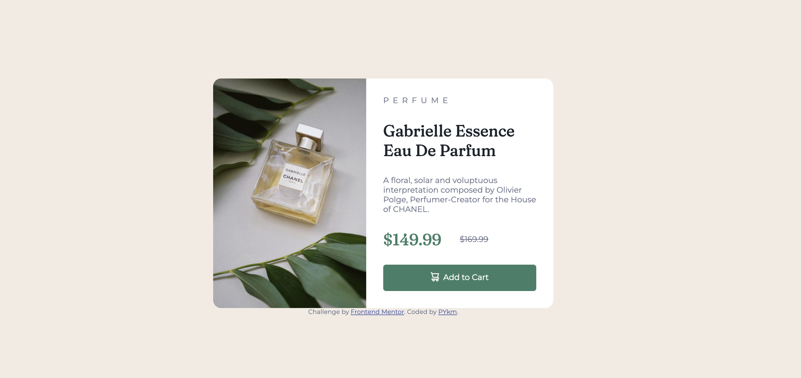

# Frontend Mentor - Product preview card component solution

This is a solution to the [Product preview card component challenge on Frontend Mentor](https://www.frontendmentor.io/challenges/product-preview-card-component-GO7UmttRfa). Frontend Mentor challenges help you improve your coding skills by building realistic projects.

## Table of contents

- [Overview](#overview)
  - [The challenge](#the-challenge)
  - [Screenshot](#screenshot)
  - [Links](#links)
- [My process](#my-process)
  - [Built with](#built-with)
  - [What I learned](#what-i-learned)
  - [Continued development](#continued-development)
  - [Useful resources](#useful-resources)
- [Author](#author)
- [Acknowledgments](#acknowledgments)


## Overview

### The challenge

Users should be able to:

- View the optimal layout depending on their device's screen size
- See hover and focus states for interactive elements

### Screenshot




### Links

- Solution URL: [https://www.frontendmentor.io/solutions/product-preview-card-component-OJNycfIgxG](https://www.frontendmentor.io/solutions/product-preview-card-component-OJNycfIgxG)
- Live Site URL: [https://pykm.github.io/product-preview-card-challenge-solution/](https://pykm.github.io/product-preview-card-challenge-solution/)

## My process

### Built with

- Semantic HTML5 markup
- Flexbox
- Desktop-first workflow

### What I learned

Choose proper semantic H5 element is difficult for me. I chose these elements:

```html
<main>
  <picture>Product Image</picture>
  <article>Product Details</article>
</main>
```

Use Flexible box layout to position infos in Details Panel on Desktop:
```css
.product_detail{
	display: flex;
	flex-direction: column;
	justify-content: space-between;
}
```

### Continued development

Concepts that I'm not completely comfortable with, used in this challenge:
- Article Element
- Flexible Box layout

Techniques that I found useful, although not using in this challenge
- CSS Custom properties
- SASS

### Useful resources

- [Kevin Powell's solution](https://github.com/kevin-powell/product-preview-card-component-main#links) - This solution helped me to confirm a lot of things on layout. Besides, I got to know the picture element, flex and grid layout.
- [Details of flexible box layout on MDN](https://developer.mozilla.org/en-US/docs/Web/CSS/CSS_Flexible_Box_Layout/Controlling_Ratios_of_Flex_Items_Along_the_Main_Ax) - This is an amazing article which helped me finally understand Flex container, flex items, how to align flex items and how to control ratios of flex items. I'd recommend it to anyone still learning this concept.
- [CSS Responsiveness on Marksheet.io](https://marksheet.io/css-responsiveness.html) - This is a time-saving article, I was using the Desktop-first workflow code in this page to do the responsiveness part.
- [Google Fonts](https://developers.google.cn/fonts/docs/getting_started) - This article includes examples on how to use the google fonts, and it's especially useful for coders in China.

## Author

- Website - [PYkm](https://pykm.github.io/)
- Frontend Mentor - [@PYkm](https://www.frontendmentor.io/profile/PYkm)

## Acknowledgments

Thanks to people and organizations below, who really inspired and helped me during the challenge.
- **Kevin Powell**. When I was streching my head about the layout, your solution absolutely helped a lot.
- **Marksheet by Jeremy Thomas**. Meet you in your famous "Web Design in 4 minutes". Read all articles on marksheet.io. I was using the reset.css and the media queries you provided. It's a timesaving.
- **MDN**. Always using you as a reference book, the content is useful, learned a lot more than ever.
